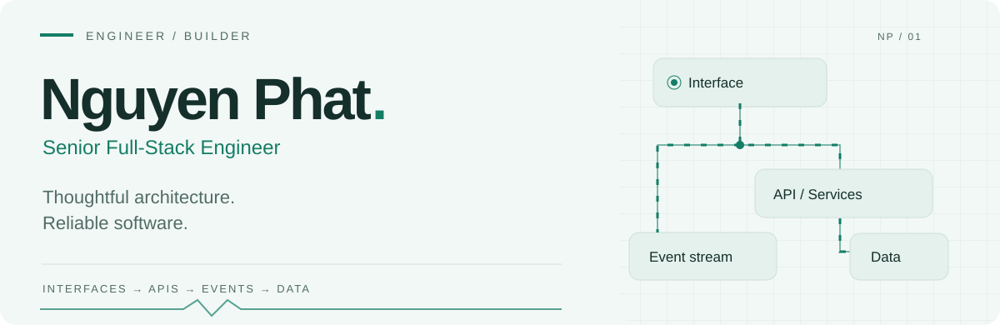
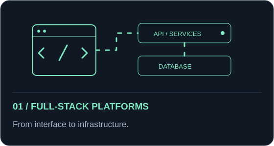
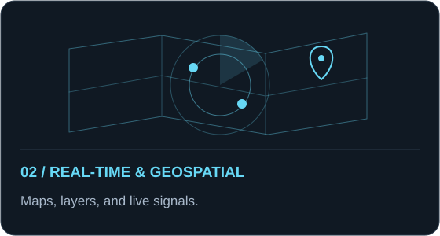
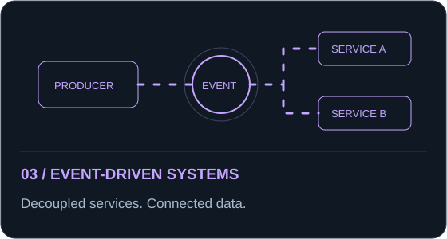
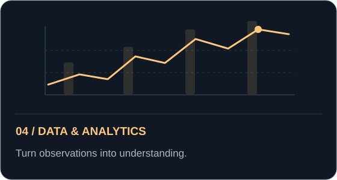
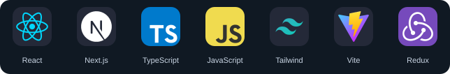
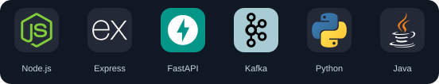
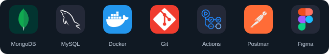
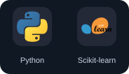

  <picture>
    <source media="(prefers-color-scheme: dark)" srcset="./assets/header-dark.svg" />
    <source media="(prefers-color-scheme: light)" srcset="./assets/header-light.svg" />
    
  </picture>

  
<strong>Full-stack engineering &nbsp; / &nbsp; Real-time systems &nbsp; / &nbsp; Software architecture</strong>

  
I build connected software systems, from the interface to the infrastructure.

  <a href="https://github.com/NguyenPhat2412?tab=repositories">Explore repositories ↗</a>
  &nbsp; · &nbsp;
  <a href="#technology">Technology</a>
  &nbsp; · &nbsp;
  <a href="#activity">Activity</a>

 

## 👨‍💻 A little about me

I'm **Nguyen Phat**, a Senior Full-Stack Engineer working across frontend applications, backend APIs, data, and deployment. I care about clear service boundaries, responsive interfaces, and systems that remain understandable as they grow.

- **Building across the stack** — React and Next.js interfaces connected to Node.js and Python APIs.
- **Connecting systems** — real-time experiences with WebSocket, Socket.io, and Kafka.
- **Thinking beyond delivery** — security, testing, observability, and performance are part of the design.

> Understand the problem. Design with intent. Build, measure, and improve.

## 🚀 What I work on

  
  
  
  

| Focus | Engineering work |
| :--- | :--- |
| **Full-stack platforms** | Typed interfaces, reusable components, API contracts, authentication, and data modeling. |
| **Real-time & geospatial** | Interactive maps, GeoJSON layers, live events, and environmental data visualization. |
| **Event-driven systems** | Kafka producers and consumers, asynchronous processing, and decoupled services. |
| **Data & analytics** | Python workflows for data preparation, analysis, visualization, and machine learning. |

Many of my current projects live in private repositories. This profile shares my technical focus and public work.

<a href="https://github.com/NguyenPhat2412?tab=repositories"><strong>Browse my public work →</strong></a>

## 🛠️ My toolkit

**🎨 Frontend** 
React · Next.js · TypeScript · Tailwind CSS · React Native

**⚙️ Backend & messaging** 
Node.js · Express · FastAPI · Kafka · WebSocket · Socket.io

**🐳 Data & delivery** 
MongoDB · MySQL · SQL Server · Docker · Git · GitHub Actions

**📊 Data science** 
Python · Pandas · NumPy · Scikit-learn · Matplotlib

<strong>More tools and engineering principles</strong>

 

| Area | Also in my toolkit |
| :--- | :--- |
| Languages | JavaScript, Java, HTML, CSS |
| Frontend | Redux, Leaflet, React Leaflet, GeoJSON |
| Analytics | Pandas, NumPy, Scikit-learn, Matplotlib |
| Delivery & tooling | Docker Compose, Vercel, Render, Postman, Figma |

**How I approach a system**

1. Define responsibilities and the contracts between components.
2. Model data around the domain and its access patterns.
3. Make authentication, authorization, and validation explicit.
4. Design for failures and make behavior observable.
5. Measure before optimizing; introduce complexity when it is needed.

## 🧭 Currently exploring

**System design** · **Distributed systems** · **Scalable APIs** · **Cloud & DevOps**

I'm interested in how architecture, performance, and developer experience come together as a product grows.

## 🐍 Beyond the commits

<picture>
  <source media="(prefers-color-scheme: dark)" srcset="https://raw.githubusercontent.com/NguyenPhat2412/NguyenPhat2412/output/github-contribution-grid-snake-dark.svg" />
  <source media="(prefers-color-scheme: light)" srcset="https://raw.githubusercontent.com/NguyenPhat2412/NguyenPhat2412/output/github-contribution-grid-snake.svg" />
  
</picture>

Generated every 12 hours by <a href="https://github.com/NguyenPhat2412/NguyenPhat2412/actions/workflows/snake.yml">GitHub Actions</a>. <a href="https://github.com/NguyenPhat2412">View contributions ↗</a>

  

---

  <h3>Good software starts with a good conversation.</h3>
  
Interested in web platforms, developer tools, real-time systems, and open source.

  <a href="https://github.com/NguyenPhat2412?tab=repositories"><strong>Explore what I'm building ↗</strong></a>
    
  NGUYEN PHAT &nbsp; / &nbsp; BUILD · MEASURE · IMPROVE

<!-- Layout inspiration: https://github.com/MaxRohowsky/best-github-profile-readme
     In particular: adamalston (banner and grouped stack), MacroPower (concise introduction).
     Banner artwork is original and stored in assets/ to avoid an external rendering dependency. -->

<!-- Technology icons: tandpfun/skill-icons (MIT); see assets/icons/LICENSE.
     Animated SVG artwork is original. Motion respects prefers-reduced-motion. -->
